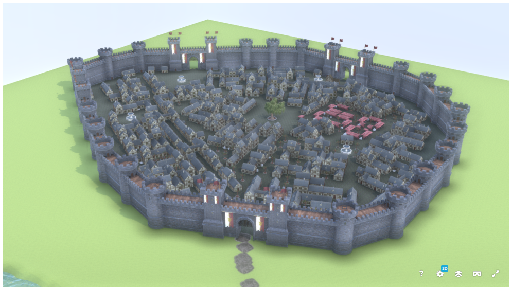
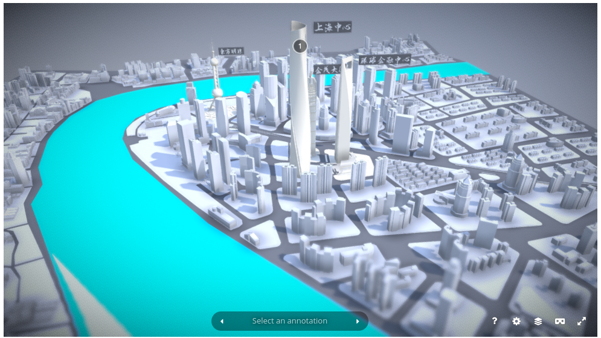
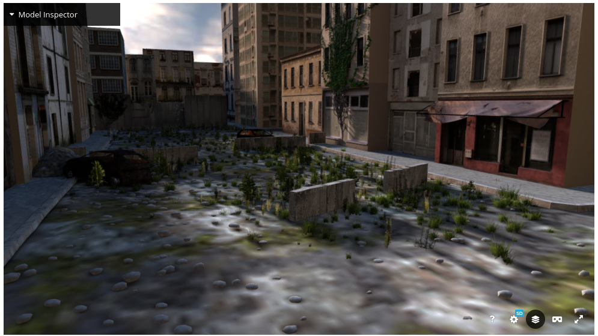
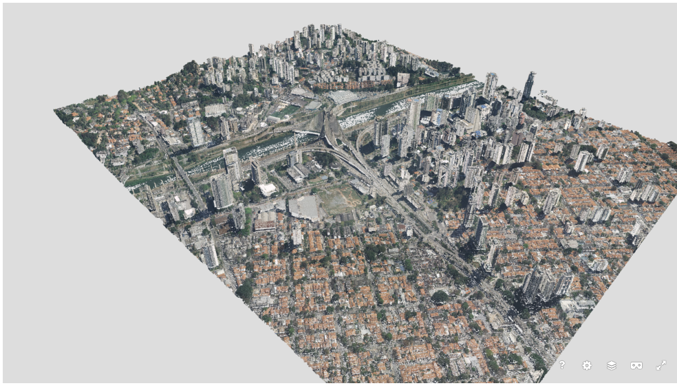
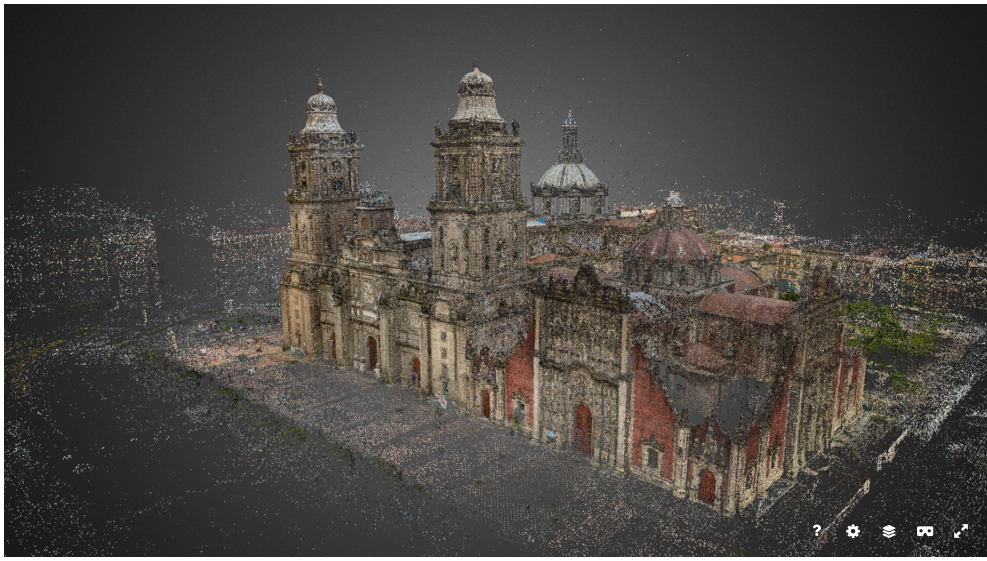

# Unidade I - Atividade Avaliativa

## Objetivos:

1. Reforçar os conceitos discutidos ao longo da **Unidade I** referentes 
a modelagem de objetos e sintese de imagem com o *Pipeline* Gráfico tradicional, 
baseado em rasterização;
2. Utilizar as ferramentas fornecidas pelo *framework Three.JS* para controle das 
diversas etapas do processo de síntese de imagem de modelos poligonais, 
baseado no processo de rasterização.

## Motivação:

Com a miniaturização de diversos tipos de dispositivos, como cameras de vídeo, processadores, armazenamento externo, etc. 
é possível hoje realizar filmagens sofisticadas com baixo custo obtendo um resultado bastante criativo e realista.

Um exemplo disso são os vídeos amadores como a do [Drone Superman](https://www.youtube.com/watch?v=elKnq8QlB_Q). O autor acopla os braços de um
boneco do Superhomem a um drone, produzindo um vídeo de um sobrevoo em um cenário do ponto de vista de primeira pessoa desse 
personagem. Outra variação é o uso de uma miniatura do mesmo Superhomem, agora com um ponto de vista de 
[terceira pessoa](https://www.youtube.com/watch?v=c6Hp0wQ6_80) .

Ainda mais fácil que a geração do vídeo anterior são aqueles produzidos a partir de cenários virtuais, que podem ser contruídos utilizando modeladores como o *SketchUp* ou o *Maya*, como os exemplos da Figura 1. 

 
 
 

*Figura 1 - Modelos poligonais de ambientes externos de larga escala, gerados por modeladores.*

Cenários reais podem ser "digitalizados" utilzando drones para capturar fotografias aéreas de edificações ou até mesmo de partes de uma cidade[^1] e 
gerar nuvens de pontos, a partir das quais é possivel gerar um modelo 3D poligonal dessas estruturas de larga escala.

 
 

*Figura 2 - Modelos poligonais de ambientes externos de larga escala, gerados a partir de captura.*

O uso de cenários virtuais, modelados ou capturados, permite gerar sequencias de vídeos com um controle de camera mais criativo e de menor custo, uma vez que uma camera virtual pode executar movimentos que, mesmo para drones, se tornam fisicamente impossíveis. 

## A Atividade:

Voce foi chamado para fazer um "*freela*" para uma grande produtora de videos de Salvador, especializada em  
gravar filmes com sequencias aéreas, geradas por drone, de grandes obras governamentais, empreendimentos imobiliários, 
entre outras estruturas de larga escala. Sabendo que voce está cursando Computação Gráfica na UFBA os donos da produtora 
o procuraram na certeza de que voce é a pessoa certa para ajudá-los. 

Segundo os produtores essas sequencias são bastante custosas de serem geradas pois nem sempre agradam ao cliente de primeira. 
E nesse caso precisam ser feitas novamente, gerando custos extras não previstos. 

Portanto, para ter uma ideia do resultado final antes de fazerem a captura usando drones no local, os produtores querem gerar 
sequencias simuladas, que permitam prever o resultado do vídeo percorrendo a estrutura. Dessa forma várias estratégias/percursos
podem ser gerados e apresentados aos clientes, que podem escolher qual a sequencia que mais os agrada. 

Para empreendimentos imobiliários os modelos CAD podem ser utilizados como entrada do simulador. Para os modelos gerados 
por fotos aéreas, os produtores presumem também que o modelo já foi previamente capturado e está em formato de nuvem de pontos ou 
malha poligonal [^2]. 

Por fim, para ter uma ideia da escala das estruturas que estão sendo sobrevooadas, os produtores adoraram a ideia do *Drone Superman*, 
de colocar um modelo de referencia [4] na frente da camera, e gostaria que o simulador gerasse a sequencia de animação com um 
avatar semelhante ao *Superman*, dando a sensação de uma visualização em primeira ou terceira pessoa. 

## Os Requisitos:

Os produtores querem uma protótipo capaz de:

1. Carregar um modelo de grande estrutura [^3] (prédio, cidade, parque, shopping, ...) [4];
2. Gerar uma animação baseada na movimentação da camera capaz de fazer um sobrevoo pela estrutura;
3. O movimento de camera deve ser suave, realista e permitir passar pelos seus principais pontos; 
4. Considere que devem existir no mínimo 3 pontos principais que vão guiar o caminho da camera durante a animação;
6. A sequencia de animação deve ser visualizada em dois modos simultaneamente: a visão da camera do drone e uma visão externa 
que permita acompanhar o caminho da camera pela estrutura;
7. Uma GUI simples deve conter controles para pausar e tocar a animação. A animação deve ser executada em modo loop, ou seja, 
a menos que seja pausada ela se repete o tempo todo;
8. Associada a camera deve haver um modelo de referencia (como o do exemplo do *Drone Superman* que permita indicar um visão de primeira ou terceira pessoa. A escolha do modelo de referência fica a critério do desenvolvedor, que pode utilizar, por exemplo modelos de [5];
9. A visualização em primeira pessoa, terceira pessoa ou no modo drone simples deve ser controlada via GUI.  

## Entrega e Critérios de Avaliação:

O trabalho será submetido individualmente através do repositório disponibilizado pelo professor, via *GitHub Classroom*, para essa atividade. 

> **Não serão consideradas versões enviadas por e-mail, Google Classroom, Discord, ou outros meios.**

O trabalho será avaliado a partir dos seguintes critérios:

| Critério | Pontuação |
| :--- | :---: |
| 1. Relatório (README) | 0,5 |
| 2. Carregamento do cenário | 1,0 |
| 4. Geração da sequencia de animação |  |
|   Animação com 3 pontos de interesse | 1,5 |
|   Visualização em terceira pessoa (com avatar) | 2,0 |
|   Visualização em primeira pessoa (com avatar) | 2,0 |
| 5. Visualização simultanea do cenário e da camera | 2,0 |
| 6. Criatividade na definição do cenário | 0,5 |
| 6. Criatividade na construção do movimento de camera | 0,5 |

Espera-se no relatório uma breve descrição de como sua solução foi construída, ressaltando aspectos teoricos de CG [1] utilizados, 
bem como aspectos práticos do *framework Three.JS* [2] [3]
O relatório deve ser escrito utilizando a linguagem *markdown* [5] e **substituir o README original do repositório**. 

## Penalidades:              

> Submissões feitas após o prazo limite serão penalizadas em 1,0 ponto por dia de atraso.
> 
> Não haverá ressubmissão para códigos com erros de configuração de *paths*, falta de componentes, modelos ou qualquer elemento que "quebre" o código e impeça a correção. Fique atento e teste bem seu código antes do envio!
> 
>> **Em casos de plágio (total ou parcial) todos os envolvidos terão suas notas zeradas**. 

## Observações importantes:              

> Não presuma nada! Em caso de dúvida pergunte ao professor. 
> 
> Perguntas e dúvidas **gerais** devem ser postadas no canal do *Discord* específico. 
>
> **Dúvidas específicas** envolvendo seu código ou sua solução devem ser enviadas pelo *Discord* como mensagens privadas. 
>
> Mantenha sempre seu repositório atualizado para que o professor e o monitor da disciplina possam ter acesso ao código e ajuda-lo nas suas dúvidas.  

## Referências: 

[1] 	MARSCHNER, Steve; SHIRLEY, Peter. "**Fundamentals of Computer Graphics**". 5th Edition CRC Press, 2021.

[2]		Dirksen, J., **Learn Three.JS: Program 3D animations and visualizations for the web with JavaScript and WebGL**. 4th Edition, Packt Publishing, 2023.

[3]		**Three.JS**. https://threejs.org/docs/index.html.

[4]   **SkecchFab**. https://sketchfab.com/feed.

[5]   **Mixamo**. https://www.mixamo.com/#/.

[5]   Markdown Cheat Sheet. **A quick reference to the Markdown syntax**. disponível em: https://www.markdownguide.org/cheat-sheet/ 

[^1]: Para modelos de larga escala como cidades é necessário equipamentos com maior autonomia e capacidade do que drones
domeśticos.

[^2]: Uma das ideias da produtora é em um segundo projeto usar técnicas como *3D Gaussian Splatting* para gerar os videos
a partir dos modelos gerados por essa técnica, garantindo o fotorealismo dos modelos gerados a partir de fotos. 

[^3]: Modelo de grande estrutura não significa necessariamente um modelo de tamanho (espaço de armazenamento) igualmente grande.
