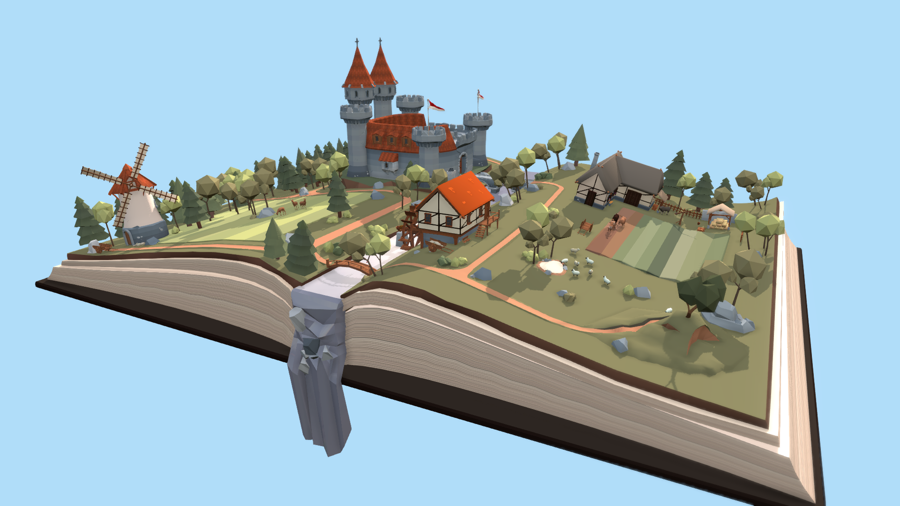
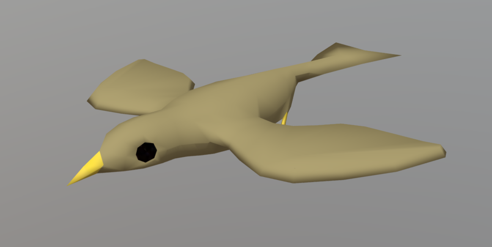
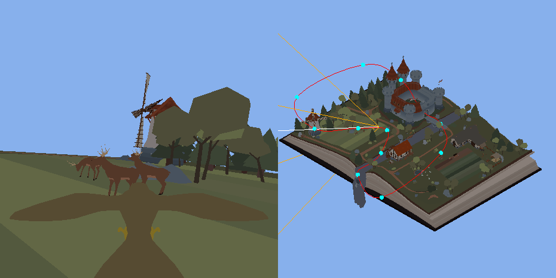
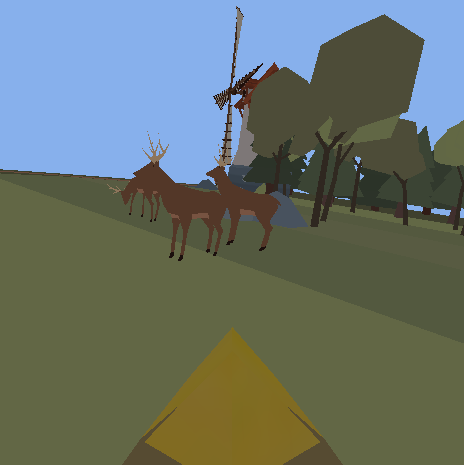
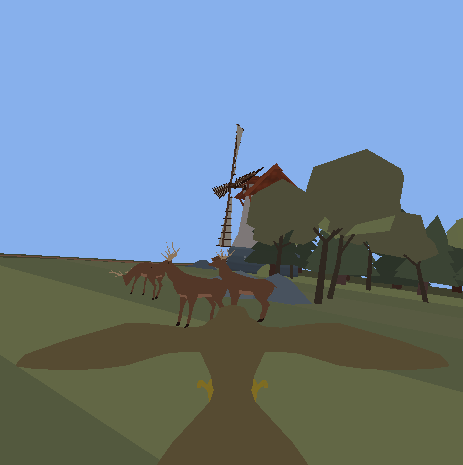
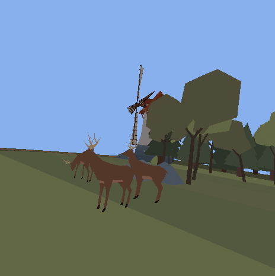
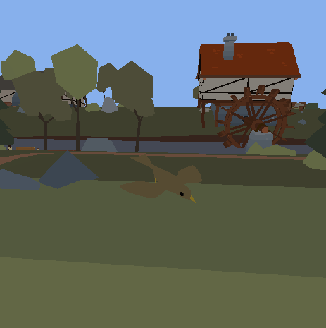
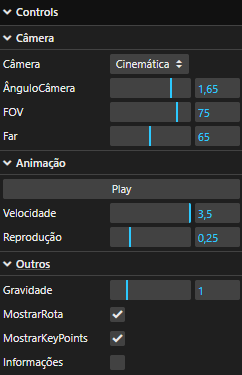

# Relatório Trabalho 1 - MATA65 (Computação Gráfica)
## Introdução
Neste repositório se localiza o produto final do trabalho que marca a conclusão da unidade 1 da disciplina MATA65 - Computação Gráfica na UFBA no semestre 2024.2, ministrada pelo professor [Antônio Apolinário](https://computacao.ufba.br/pt-br/antonio-lopes-apolinario-junior), responsável pelas especificações do trabalho. Para executar a aplicação, é importante ter a pasta [Assets](https://github.com/LucasTBorges/Assets) na raíz do web server que está o executando. A navegação da aplicação se dá a partir do index.html, localizado na pasta CodigoBase.
Nós fomos orientados a desenvolver uma aplicação utilizando a biblioteca [Three.js](https://threejs.org/) que nos permitisse visualizar um cenário sob dois pontos de vista simultaneamente: uma câmera estática e uma câmera que acompanha um agente representado por um modelo 3D percorrendo um circuito em loop pela cena.
Dentre os requisitos impostos, se encontravam:
 - Na visualização que acompanha o avatar pelo cenário, deve ser possível alternar entre as perspectivas de Primeira Pessoa, Terceira Pessoa e "Drone Normal".
 - O movimento da câmera deve ser suave e realista.
 - Deve ser possível pausar e reproduzir a execução da animação.
## Modelos 3D

As especificações do trabalho, localizadas neste mesmo repositório, dão liberdade criativa para a escolha dos modelos do avatar e do cenário. Dessa forma, escolhi, para o cenário, o modelo de um [feudo sobre um livro de fantasia medieval](https://sketchfab.com/3d-models/medieval-fantasy-book-06d5a80a04fc4c5ab552759e9a97d91a), disponível para download no SketchFab sob a publicação do usuário [Pixel](https://sketchfab.com/stefan.lengyel1). Para o avatar acompanhado pela câmera, optei pelo modelo de um [pássaro](https://sketchfab.com/3d-models/low-poly-bird-942ffdab96bb48a7bb1612b461386310), também disponível para download no SketchFab, sob a publicação do usuário [AlexFerrart3D](https://sketchfab.com/alexferrart3D).

## Movimentação da Câmera

**Translação:** A fim de traçar uma trajetória flúida para a câmera, decidi deslocá-la ao longo de uma [spline de Catmull-Rom](https://www.cs.cmu.edu/~fp/courses/graphics/asst5/catmullRom.pdf). Esta curva paramétrica, gerada a partir de uma lista de pontos no espaço, é uma spline interpolante, o que significa que os pontos definidos por mim farão parte da curva gerada, me dando mais controle sobre o circuito percorrido pela câmera. Por fim, já [existe uma implementação desta curva no Three.js](https://threejs.org/docs/#api/en/extras/curves/CatmullRomCurve3), o que foi mais um motivo para escolher essa abordagem no meu projeto.

**Rotação:** Outra vantagem da utilização da spline de Catmull-Rom é o fato de que ela possui continuidade de classe $C^1$. Utilizar a tangente da curva para determinar a direção para a qual a câmera deve apontar em qualquer ponto me pareceu a escolha natural nessa situação.

## Visualizações Simultâneas

Cada frame da animação possui duas visualizações simultâneas da cena. A primeira, localizada na esquerda, é a visualização de uma [câmera que faz uso de projeção perspectiva](https://threejs.org/docs/#api/en/cameras/PerspectiveCamera) e acompanha o avatar percorrendo o cenário. A segunda, localizada na direita, é a visualização de uma [câmera ortográfica](https://threejs.org/docs/#api/en/cameras/OrthographicCamera) (faz uso de projeção paralela) que não sofre nenhuma tranformação durante a execução da aplicação.
Na visualização da câmera ortográfica é possível visualizar alguns elementos não presentes na primeira visualização:
 - Um [Camera Helper](https://threejs.org/docs/#api/en/helpers/CameraHelper) referente à primeira visualização: segmentos de linha que auxiliam a visualizar o frustrum da câmera ativa.
 - Uma curva vermelha que descreve a trajetória da câmera na animação, cuja visualização pode ser desligada através da GUI.
 - Esferas ciano representando os pontos a partir dos quais a curva foi gerada. Como todas as esferas compartilham da mesma geometria e material, foi possível fazer uso da [InstancedMesh](https://threejs.org/docs/#api/en/objects/InstancedMesh) do Three.js ao invés de criar as malhas das esferas uma a uma e passar, de forma redundante, as mesmas informações de geometria e material toda vez. Essa escolha ainda otimiza a performance da aplicação pois diminui o número de draw calls realizadas. A visualização das esferas pode ser desligada através da GUI.

## Diferentes Câmeras

 A especificação do trabalho indica que deve ser possível alternar entre as câmeras em Primeira Pessoa, Terceira Pessoa e "Drone Normal" através da GUI. Para além das três câmeras obrigatórias, minha aplicação também inclui a opção "Cinematográfica".

---
 
 ### Primeira pessoa:
 
 
 
  Câmera posicionada de forma a simular a experiência do pássaro, com a visão parcialmente obstruída pelo bico.

---
  
 ### Terceira Pessoa:
 

Câmera posicionada atrás e um pouco acima do pássaro.

---

### Drone Normal:

Similar à visão em primeira pessoa, mas a visão não é obstruída por nenhuma parte do modelo do pássaro.

---

### Cinematográfica:

Posicionada a uma distância fixa do avatar, esta visão se diferencia das outras pois compartilha apenas as transformações de translação com o pássaro. Por não sofrer as mesmas transformações de rotação das outras câmeras, em alguns momentos veremos o pássaro de frente, em outros de lado e em outros de costas, a depender da direção para a qual o modelo está voltado. Entretanto, através da GUI, é possível controlar manualmente a rotação da câmera cinematográfica ao redor do pássaro. A intenção da inclusão dessa visão é poder visualizar as transformações de rotação aplicadas sobre o pássaro.

---

Para posicionar as câmeras com referência ao pássaro, utilizei [grupos](https://threejs.org/docs/?q=group#api/en/objects/Group) do Three.js para realizar o posicionamento no sistema de coordenadas local ao invés de no espaço do mundo. 
Criei um grupo para aplicar as tranformações de translação da animação e dentro dele criei um grupo para aplicar as transformações de rotação. No grupo de rotação incluí o modelo do pássaro e as câmeras de Primeira Pessoa, Terceira Pessoa e Drone Normal. No grupo pai, o grupo de translação, incluí a câmera cinematográfica. O resultado é que todas as câmeras e o modelo sofrem as transformações de translação acompanhando a spline ao longo da animação, mas as transformações de rotação (acompanhando a tangente da spline) não atingem a câmera cinematográfica, como pretendido.

## Circuito

A rota que tracei para o passáro foi formada pela interpolação de 12 pontos no cenário que determinei para que ela seguisse o seguinte percurso:

 1. O pássaro começa passando por cima da cachoeira;
 2. Em seguida, passa por debaixo da ponte com o pescador;
 3. Sobrevoa os cervos;
 4. Contorna o moinho de vento;
 5. Passa por entre as torres mais altas do castelo e dá um "mergulho", saindo pelas portas da construção;
 6. Vira a direita na casa com telhado cinza;
 7. Sobrevoa as ovelhas;
 8. Volta ao ponto inicial.

## Modo Câmera Livre

Para facilitar a montagem da curva, adicionei um modo de câmera livre à aplicação, acessível pela aba "Câmera Livre". Nela, faço uso dos [Fly Controls](https://threejs.org/docs/#examples/en/controls/FlyControls) do Three.js. Nesse modo, é possível navegar livremente pelo cenário. Assim, para montar o caminho, bastou navegar pela câmera livre até o local que eu achava apropriado para a adição de um ponto à minha lista de pontos e registrar a coordenada no espaço do mundo, que é pode ser encontrada na janela de informações, habilitada através da interface gráfica.

## GUI (Interface Gráfica)

A interface para os controles da aplicação foi gerada com a biblioteca [lil-gui](https://lil-gui.georgealways.com/). Nem todos os controles estão disponíveis no modo de câmera livre, pois apenas alguns controles fazem sentido nesse modo.

**Câmera:**
 - *Câmera*: Menu dropdown para selecionar a câmera ativa da visualização de perspectiva (PrimeiraPessoa, TerceiraPessoa, DroneNormal ou Cinematográfica).
 - *ÂnguloCâmera*: Visível apenas quando a câmera cinematográfica está selecionada, controla a rotação da câmera cinematográfica ao redor do pássaro.
 - *FOV*: Controla o campo de visão da câmera da visualização de perspectiva.
 - *Far*: Controla a distância do plano *far* de recorte da câmera (plano que limita o quão longe a câmera enxerga).

**Animação:**
 - *Botão Play/Pause*: Retoma/Pausa a reprodução da animação.
 - *Velocidade*: Controla a velocidade da reprodução da animação.
 - *Reprodução*: Controla a posição da câmera na spline. Automaticamente atualizado durante a animação, mas pode ter seu valor modificado manualmente pelo usuário.

**Outros:**
 - *Gravidade*: Controla a influência da orientação do pássaro em sua velocidade. Em 0, a velocidade é constante durante todo percurso, para qualquer outro valor, o pássaro fica mais rápido quando inclinado para baixo (quanto menor a coordenada y do vetor de direção, mais rápido). Essa funcionalidade torna a simulação um pouco mais realista e a diferença é mais perceptível no momento da animação no qual o pássaro "dá um mergulho" dentro do castelo.
 - *MostrarRota*: Checkbox que habilita/desabilita a visualização da curva que descreve a trajetória do grupo de translação.
 - *MostrarKeypoints*: Checkbox que habilita/desabilita a visualização das esferas que representam os pontos utilizados para gerar a spline.
 - *Informações*: Checkbox que habilita/desabilita a visualização da janela de debug, com algumas informações úteis durante o desenvolvimento sobre o estado atual da simulação.
